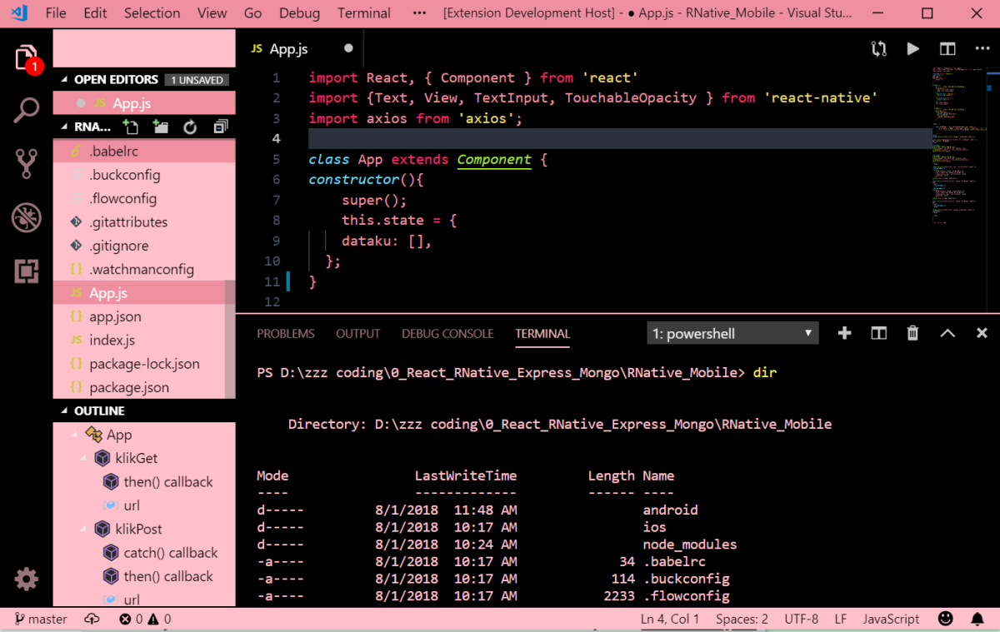

# Hello Blinks!

Blackpink (블랙핑크 stylized as BLΛƆKPIИK) is a South Korean girl group formed by YG Entertainment, consisting of members: Jisoo, Jennie, Rosé and Lisa. The group debuted on August 8, 2016. With the group's early commercial success, they were hailed as the New Artist of the Year at the 31st Golden Disc Awards and the 26th Seoul Music Awards. As of 2018, Blackpink is the highest-charting female K-pop act on both Billboard Hot 100 and Billboard 200, peaking at number 55 with "Ddu-Du Ddu-Du", and peaking at number 40 with Square Up, respectively. They are also the first and only K-pop girl group to enter and top Billboard's Emerging Artists chart.

- Download theme: [VScode BLΛƆKPIИK Theme](https://marketplace.visualstudio.com/items?itemName=lintangwisesa.blackpink).
- Source code: [VScode BLΛƆKPIИK Theme Source Code](https://github.com/LintangWisesa/VScode-Blackpink-Theme).

## Preview 🔍

#

#### Lintang Wisesa 💌 _lintangwisesa@ymail.com_

[Facebook](https://www.facebook.com/lintangbagus) | 
[Twitter](https://twitter.com/Lintang_Wisesa) |
[Google+](https://plus.google.com/u/0/+LintangWisesa1) |
[Youtube](https://www.youtube.com/user/lintangbagus) | [GitHub](https://github.com/LintangWisesa) |
[Hackster](https://www.hackster.io/lintangwisesa)